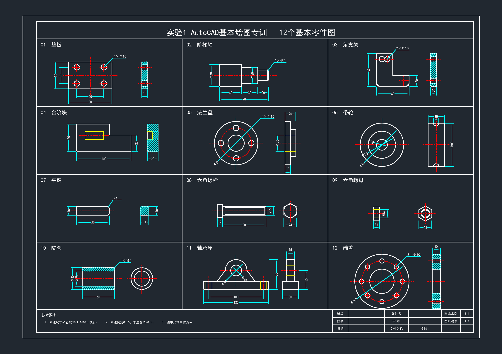
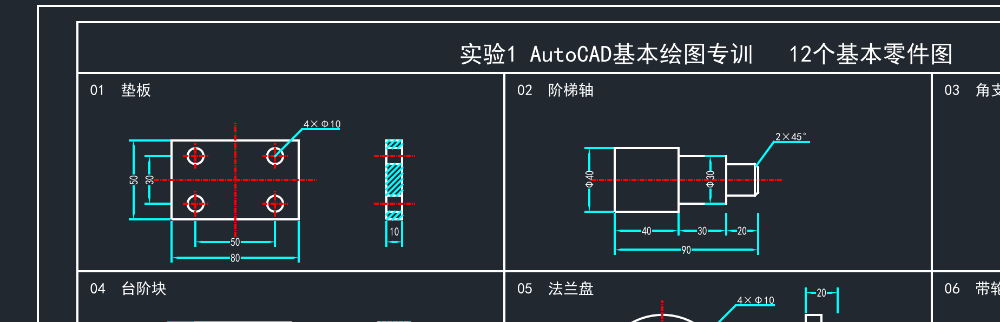
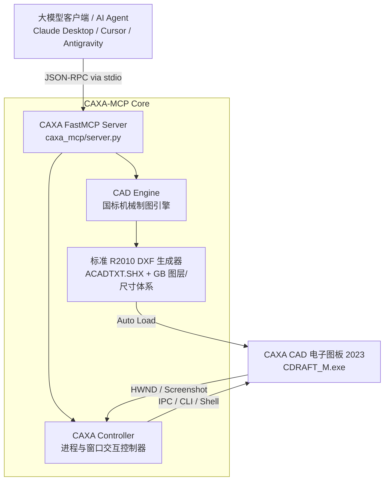

# CAXA-MCP: CAXA CAD 电子图板大模型自动化绘图服务

<p align="center">
  
  
  
  
  
</p>

<p align="center">
  <b>全球首个面向国产工业 CAD 软件「数码大方 CAXA CAD 电子图板」的 Model Context Protocol (MCP) 服务端。</b><br>
  赋予 Claude、Gemini、Cursor、ChatGPT 等大模型直接驱动 CAXA CAD 进行机械制图、参数化建模与工程图纸自动生成的能力。
</p>

---

## 📸 效果展示 (Showcase)

以下全套 12 个机械零件图纸（A1 图幅 841×594 mm，含标准图框、国标标题栏、技术要求、45°剖面线、尺寸与公差标注）**全部由 AI 通过 CAXA-MCP 自动化绘制生成并在 CAXA CAD 2023 中无缝展示**：



### 局部放大与高对比度细节

严格遵循 GB/T 14665 机械制图规范，采用高对比度纯白轮廓线与文字、醒目青色尺寸与剖面线、鲜红中心线、鲜黄虚线：



---

## 🌟 核心特性 (Key Features)

- **10 个工业级 MCP Tools**：包含环境自检、CAD 启动、图纸创建、几何原语绘制、智能尺寸标注、参数化零件生成、视口全屏缩放及无缝视口截图。
- **严格符合国家标准 (GB/T)**：
  - 图层、线型与线宽规范完全符合 **GB/T 14665**（粗实线 0.35mm、细实线 0.18mm、红点画中心线、黄虚线、青色尺寸线）；
  - 国标标准图框与标题栏符合 **GB/T 10609.1**（180mm × 56mm 标准签字栏与分区）；
  - 完美适配 A0、A1、A2、A3、A4 横竖版图幅。
- **CAXA CAD 深度进程与窗口联动**：
  - 自动定位本机 CAXA 2023 安装路径（`CDRAFT_M.exe`）；
  - 自动激活窗口并置顶；
  - 自动执行全图适量缩放（`Zoom Extents`）；
  - 免人工干预视口高清截图回传给大模型。
- **解决字体缺失弹窗**：
  - 内置 `Standard` 样式映射至 CAXA 原生 `ACADTXT.SHX`；
  - 中文文字样式映射至 `SimHei` 黑体，彻底杜绝 CAXA 打开 DXF 时的“缺少字体”弹窗提示。
- **开箱即用的参数化机械零件**：
  - 一键生成多级阶梯轴（带倒角、键槽、中心线及直径标注）；
  - 一键生成管道法兰盘（PCD 螺栓分度圆均布、螺栓孔、侧视剖面）；
  - 一键生成矩形带孔安装底板（多孔阵列、双向剖视图）。

---

## 🏗️ 架构设计 (Architecture)



---

## 📦 安装指南 (Installation)

### 1. 系统要求
- **操作系统**：Windows 10 / Windows 11 (x64)
- **CAD 软件**：CAXA CAD 电子图板 2023 或更高版本（默认安装于 `E:\CAXA` 或 `C:\CAXA`）
- **Python 环境**：Python 3.10+

### 2. 克隆与安装

```bash
git clone https://github.com/phosugar/caxa-mcp.git
cd caxa-mcp
pip install -e .
```

---

## ⚙️ 接入大模型客户端配置

### 1. Claude Desktop 配置
编辑 `%APPDATA%\Claude\claude_desktop_config.json`：

```json
{
  "mcpServers": {
    "caxa": {
      "command": "python",
      "args": ["-m", "caxa_mcp.server"],
      "env": {
        "CAXA_PATH": "E:/CAXA/caxa/2023/Bin64/CDRAFT_M.exe"
      }
    }
  }
}
```

### 2. Antigravity / Gemini CLI 配置
编辑 `~/.gemini/config/mcp_config.json`：

```json
{
  "mcpServers": {
    "caxa": {
      "command": "python",
      "args": ["-m", "caxa_mcp.server"],
      "env": {
        "CAXA_PATH": "E:/CAXA/caxa/2023/Bin64/CDRAFT_M.exe"
      }
    }
  }
}
```

### 3. Cursor 配置
在 `.cursor/mcp.json` 中配置：

```json
{
  "mcpServers": {
    "caxa": {
      "command": "caxa-mcp"
    }
  }
}
```

---

## 🛠️ MCP 工具清单 (Tools Reference)

| 工具名 | 说明 | 核心参数 |
| :--- | :--- | :--- |
| `caxa_status` | 检查本机 CAXA 安装状态、进程运行状态与窗口标题 | 无 |
| `caxa_launch` | 启动 CAXA CAD 2023 或将其窗口置顶激活 | 无 |
| `caxa_create_drawing` | 新建一张带有 GB 标准图框与标题栏的全新图纸 | `paper_size` (A0~A4), `title`, `part_no`, `material`, `scale_text` |
| `caxa_draw_primitives` | 批量绘制几何图元（直线、圆、圆弧、矩形、多段线、文字等） | `primitives` (图元列表), `auto_save` |
| `caxa_draw_dimension` | 绘制标准机械尺寸标注（线性尺寸、直径尺寸、半径尺寸） | `dim_type` (HORIZONTAL/VERTICAL/ALIGNED/DIAMETER/RADIUS), `points` |
| `caxa_draw_parametric_part` | 参数化快速绘制标准机械零件 | `part_type` (stepped_shaft / flange / plate), `params` |
| `caxa_open_drawing` | 控制 CAXA CAD 打开指定 DXF/DWG 图纸并全屏展现 | `file_path`, `zoom_extents` |
| `caxa_send_command` | 向 CAXA 窗口发送 CAD 命令快捷键或执行宏 | `command_string`, `press_enter` |
| `caxa_capture_screen` | 捕获当前 CAXA CAD 绘图视口截图回传大模型 | `output_path` |
| `caxa_export_drawing` | 将当前绘制成果导出保存为指定文件 | `output_path` |

---

## 💡 使用示例 (Examples)

### 示例 1：绘制多级传动阶梯轴
运行示例脚本：
```bash
python examples/02_draw_stepped_shaft.py
```
该脚本将绘制包含调质热处理要求、4段阶梯、倒角与全套直径/长度尺寸的传动轴，并在 CAXA CAD 中全屏展示。

### 示例 2：绘制管路法兰盘
运行示例脚本：
```bash
python examples/03_draw_flange.py
```
自动生成外径 165mm、内孔 50mm、PCD 125mm 均布 4×Φ18 螺栓孔的法兰盘正投影与剖面侧视图。

### 示例 3：电气工程零部件——图块与复用训练 (A3全图)
运行示例脚本：
```bash
python examples/04_exp2_electrical_parts.py
```
一键生成标准 A3 横向图幅下的 4 个电气设备机加工零件（电机转轴、端盖法兰盘、接线盒安装板、电机散热风扇轮毂），自动封装 `TITLE_BLOCK_A3` 参数化属性标题栏、`MOTOR_END_COVER` 与 `TERMINAL_PLATE` 具名工程图块，并导出独立图块库与 4K 超清光栅预览。

### 示例 4：自然语言直接驱动
在支持 MCP 的 AI 聊天窗口中直接输入：
> *“帮我在 CAXA 里绘制一个法兰盘：外径 120mm，内径 40mm，厚度 15mm，在 85mm 分度圆上均布 4 个 12mm 螺栓孔，带尺寸标注，使用 A3 国标图纸。”*

AI 将自动调用 `caxa_draw_parametric_part` 工具，2 秒内即可在您的 CAXA 屏幕上完成出图！

---

## 🧪 自动化测试 (Tests)

运行全套单元与拓扑校验测试：
```bash
python tests/test_caxa_mcp.py
```

---

## 🤝 参与贡献 (Contributing)

欢迎提交 Issue 和 Pull Request！
- 欢迎扩展更多国标标准件库（齿轮、轴承、弹簧、花键、箱体等）；
- 欢迎贡献 CAXA 3D (实体设计) 联动接口；
- 欢迎适配更多 CAXA 历史版本或 AutoCAD / 浩辰 CAD / 中望 CAD 跨平台扩展。

---

## 📄 开源许可 (License)

本项目采用 [MIT License](LICENSE) 开源许可证。
Copyright (c) 2026 [phosugar](https://github.com/phosugar).
